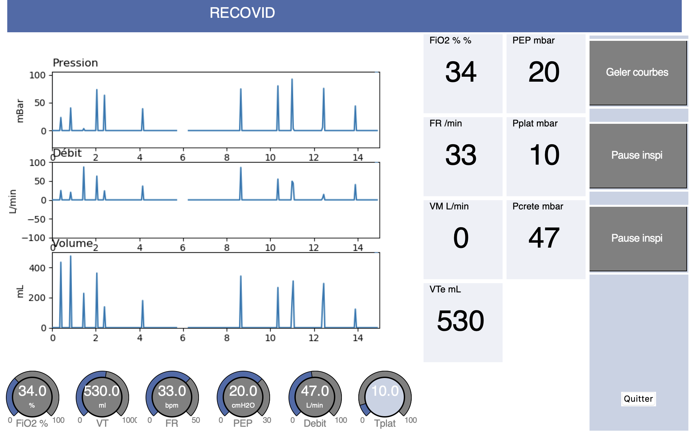

# Recovid IHM

Vous trouverez ci-dessous une image de l'interface Recovid (ça vaut mieux qu'un long discours et pas le temps de faire mieux pour l'instant)

# Requirement
  Python 3
  
  dépendance :
  tkinter
  matplotlib

# Tester

git clone https://github.com/Recovid/ihm.git

cd ihm

python main.py
